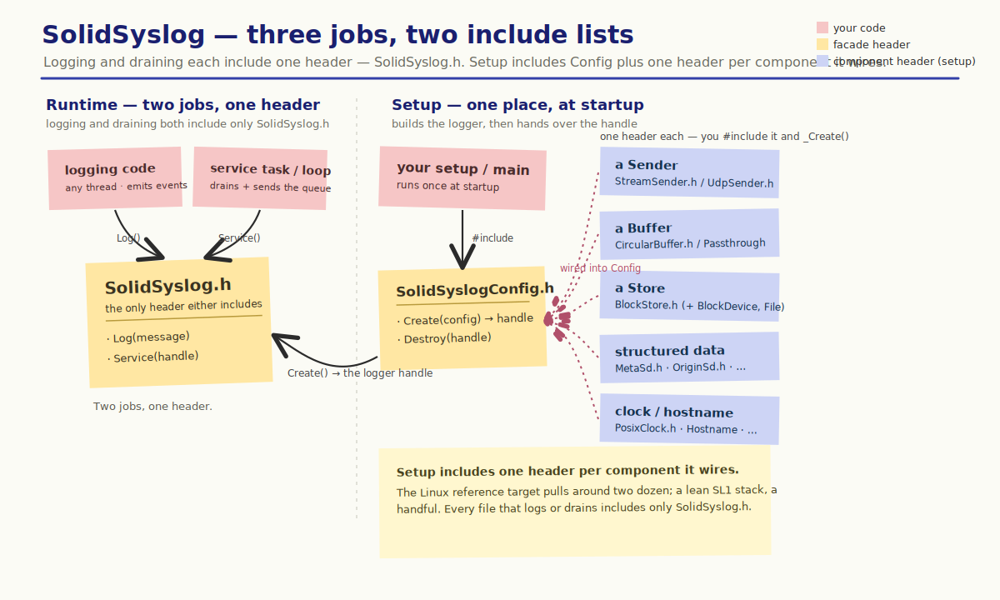

# API reference

Where to start, by what your code is doing.

<!-- markdownlint-disable MD033 — embedded as <object>, not a Markdown image, so the header stickies stay clickable through to their API pages. -->

  <object type="image/svg+xml" data="../assets/postit/api-audiences.svg" title="Three jobs: logging and draining each include only SolidSyslog.h; setup includes one header per component">
    
  </object>

<!-- markdownlint-enable MD033 -->

## Send a message

Include `SolidSyslog.h` — nothing else.

- [`SolidSyslog_Log`](../api/SolidSyslog_8h.md#function-solidsyslog_log) — emit an
  event.
- [`SolidSyslog_LogWithSd`](../api/SolidSyslog_8h.md#function-solidsyslog_logwithsd)
  — emit an event with structured data attached to that one message. Structured
  data you want on every message is wired once, on the config.

## Service the queue

Include `SolidSyslog.h` — nothing else.

- [`SolidSyslog_Service`](../api/SolidSyslog_8h.md#function-solidsyslog_service) —
  move buffered records to the store and out over the wire. Call it repeatedly,
  from a dedicated task or an existing loop.

## Create the logger

Include `SolidSyslogConfig.h`, plus one header per component you wire.

- [`SolidSyslogConfig`](../api/structSolidSyslogConfig.md) — the struct you fill
  and pass to
  [`SolidSyslog_Create`](../api/SolidSyslogConfig_8h.md#function-solidsyslog_create).
  Each slot takes a component you build first.

Find those components by [platform](../platforms/index.md) if you know your device
(Posix, lwIP, Mbed TLS, FatFs, …), or by [role](../roles/index.md) if you know the
capability you need and want to see which platform provides it.
