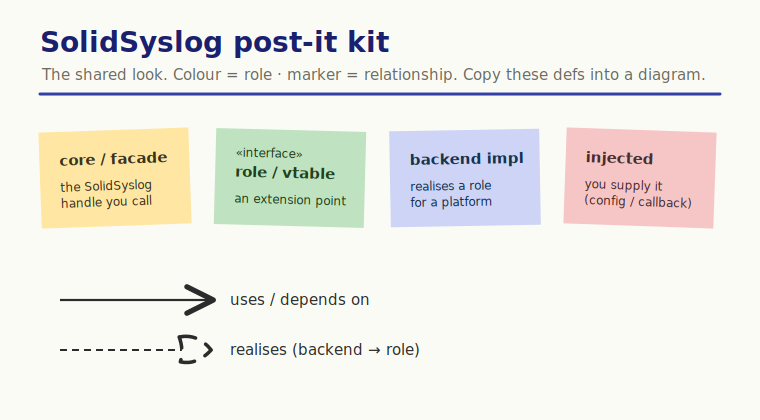

# Post-it diagram kit

A small, hand-drawn "whiteboard sticky" style for SolidSyslog diagrams — used in
the docs, the site, and articles. It keeps architecture pictures friendly and
quick to read: **colour tells you the kind of thing, the arrow tells you the
relationship.**

## The vocabulary

| Colour | Means | Example |
|---|---|---|
| Yellow | Core / facade — the thing you call | `SolidSyslog` |
| Green | A role (a vtable / extension point) | `Sender`, `Store`, `Buffer` |
| Blue | A backend that realises a role | `StreamSender`, `BlockStore` |
| Pink | Something you inject | `Config`, a clock callback, the platform socket |

| Arrow | Means |
|---|---|
| Solid head | uses / depends on |
| Hollow head | realises (a backend realises a role's vtable) |
| Pink dashed | you inject this across the boundary |

## Authoring a diagram

1. Start from [`architecture.svg`](architecture.svg) — copy it and edit the
   stickies. Each sticky is a shadowed `<rect>` plus a rotated `<g>` of text; a
   small rotation (±2°) is what sells the hand-drawn feel.
2. Keep the palette and markers identical to
   [`postit-defs.svg`](postit-defs.svg) — that consistency is the whole point.
   If you want to retune the look (roughness, shadow, arrowheads), change it in
   `postit-defs.svg` first, then carry it into the diagrams.
3. Aim for ~10–12 stickies. If it needs more, it probably wants to be two
   diagrams.

## Why the defs are copied into each diagram

Published diagrams **inline** the shared `<defs>` (filters, markers) rather than
referencing `postit-defs.svg`. GitHub's Markdown renderer sanitises cross-file
SVG references, so a self-contained file is the only thing guaranteed to render
in the repo, the docs site, and on the web. `postit-defs.svg` stays the
canonical source you copy from and the one place to tune the style.

For LinkedIn or slides, export the SVG to PNG at publish time — SVG isn't
accepted in LinkedIn articles.
