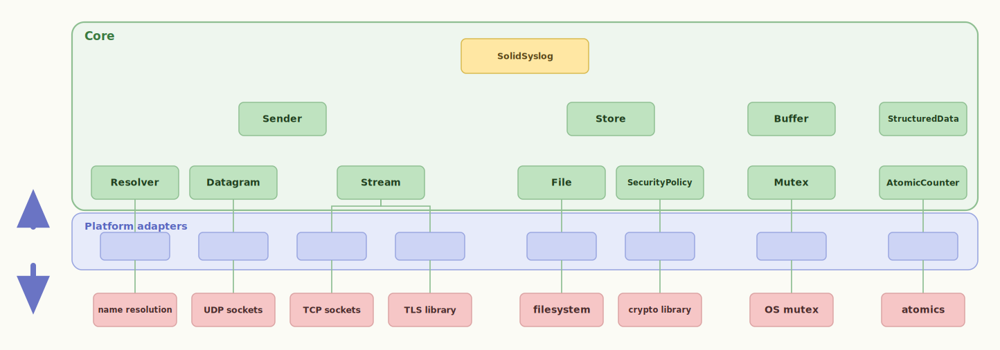

# Core

`Core/` is the guts of SolidSyslog: it implements the syslog protocol and manages the assembly, buffering, storage and sending of log messages.

`Core/` depends on nothing external: always compiled, typically as a library. It holds the facade you call, the pipeline that formats a record and drains it, and portable implementations for several roles. Where access to a network stack, encryption, filesystem or OS is required, an interface is declared. Platform components that satisfy those interfaces let Core build with no platform dependencies.

Where a [platform](../platforms/index.md) exists to reach *your* hardware, Core
exists to be the same everywhere.

<!-- markdownlint-disable MD033 — embedded as <object>, not a Markdown image, so Core and each role stay clickable through to their pages. -->

  <object type="image/svg+xml" data="../assets/postit/architecture-overview.svg" title="The SolidSyslog facade and its roles sit inside a Core boundary; the roles that need your platform cross the boundary through a thin adapter to the third-party component you supply">
    
  </object>

<!-- markdownlint-enable MD033 -->

The facade and every role link through to their API page; the platform-adapter
band links to [Platforms](../platforms/index.md).

## The facade

| Header | Provides |
|---|---|
| [`SolidSyslog.h`](../api/SolidSyslog_8h.md) | `SolidSyslog_Log`, `SolidSyslog_LogWithSd`, `SolidSyslog_Service` — the whole runtime surface |
| [`SolidSyslogConfig.h`](../api/SolidSyslogConfig_8h.md) | `SolidSyslog_Create`, `SolidSyslog_Destroy`, and the [`SolidSyslogConfig`](../api/structSolidSyslogConfig.md) struct you fill |

## What it ships

Portable [role](../roles/index.md) implementations — no platform required:

| Class | Role |
|---|---|
| [`SolidSyslogPassthroughBuffer`](../api/SolidSyslogPassthroughBuffer_8h.md) | Buffer — sends inline, no queue |
| [`SolidSyslogCircularBuffer`](../api/SolidSyslogCircularBuffer_8h.md) | Buffer — ring over caller-supplied memory, mutex injected |
| [`SolidSyslogUdpSender`](../api/SolidSyslogUdpSender_8h.md) | Sender — RFC 5426 over a Datagram |
| [`SolidSyslogStreamSender`](../api/SolidSyslogStreamSender_8h.md) | Sender — RFC 6587 octet framing over any Stream |
| [`SolidSyslogSwitchingSender`](../api/SolidSyslogSwitchingSender_8h.md) | Sender — delegates to one of several inners |
| [`SolidSyslogBlockStore`](../api/SolidSyslogBlockStore_8h.md) | Store — store-and-forward over rotating blocks |
| [`SolidSyslogFileBlockDevice`](../api/SolidSyslogFileBlockDevice_8h.md) | BlockDevice — sequence-numbered files over a File |
| [`SolidSyslogCrc16Policy`](../api/SolidSyslogCrc16Policy_8h.md) | SecurityPolicy — CRC-16 integrity (accidental corruption, not tamper) |
| [`SolidSyslogMetaSd`](../api/SolidSyslogMetaSd_8h.md) | StructuredData — sequenceId, sysUpTime, language |
| [`SolidSyslogTimeQualitySd`](../api/SolidSyslogTimeQualitySd_8h.md) | StructuredData — tzKnown, isSynced, syncAccuracy |
| [`SolidSyslogOriginSd`](../api/SolidSyslogOriginSd_8h.md) | StructuredData — software, swVersion, enterpriseId, ip |

Every role also has a Null — `SolidSyslogNull<Role>_Get()` —
whose methods are safe no-ops. That is what an unfilled slot resolves to, and
what a `_Create` returns when its pool is exhausted, so nothing dangles and
nothing needs a NULL guard. See [Roles](../roles/index.md).

## Cross-cutting

| Header | Provides |
|---|---|
| [`SolidSyslogError.h`](../api/SolidSyslogError_8h.md) | install a handler for library-internal errors; the default is a silent no-op |
| [`SolidSyslogConfigLock.h`](../api/SolidSyslogConfigLock_8h.md) | inject a lock pair around the pool slot walks; no-ops by default, single-task safe |
| [`SolidSyslogTunablesDefaults.h`](../api/SolidSyslogTunablesDefaults_8h.md) | every compile-time limit, each `#ifndef`-guarded so you override without editing the library |

## Requirements

A C99 compiler, and nothing else. No dynamic memory — every stateful class lives
in a library-internal static pool — and no OS, network or filesystem dependency.
What it cannot do alone, it delegates to a role for a [platform](../platforms/index.md)
to fill.
