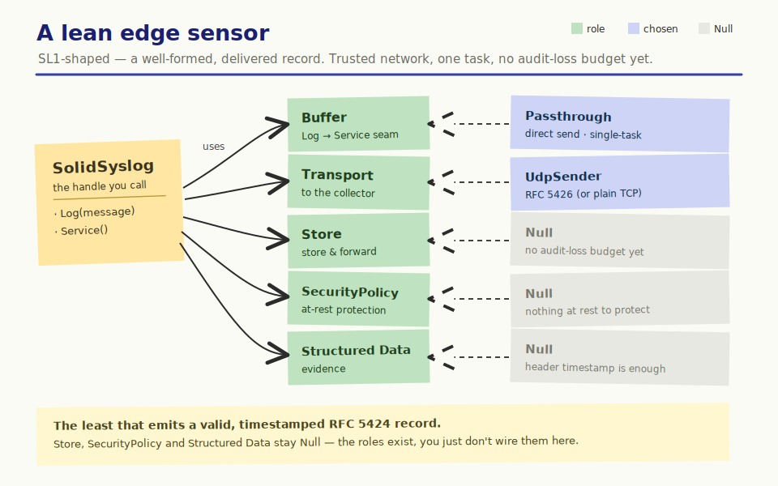
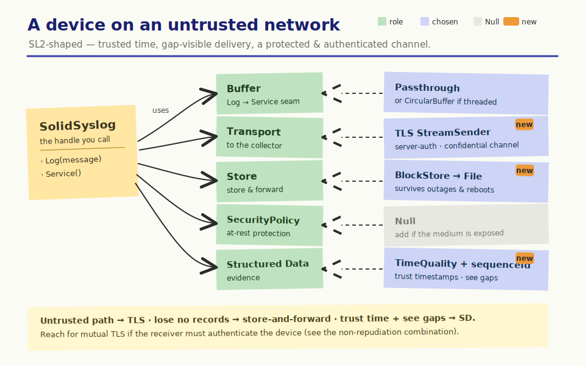
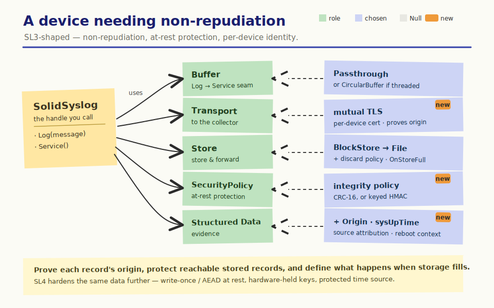

# Choosing components by Security Level

Integrating SolidSyslog is a handful of decisions. The trick to getting them
right isn't asking "what does my Security Level require?", it's asking "what
does my deployment need?" Answer that, and the components mostly pick
themselves. This page lays out those choices, what should drive each one, and how
the IEC 62443 Security Levels raise the bar as you climb them.

> [!NOTE]
> IEC 62443 certifies systems, not components, and a Security Level is a
> property of your whole system, its deployment, and its assessment, not of a
> parts list. This is our best advice on how SolidSyslog's components help you
> address the audit-logging aspects of each level; it is guidance, not a
> guarantee of compliance. The standard is also protocol-agnostic: where we name
> TLS, HMAC, or a sequence counter, those are proven ways to realise a
> capability, not the standard's own wording.

## The choices you make

Each row is a question you can answer about your own deployment. The answer
usually makes the choice for you.

| Choice | Weaker → stronger | What should push you stronger |
|---|---|---|
| **Transport & channel** | `UdpSender` / TCP `StreamSender` → server-auth TLS → mutual TLS (per-device cert, hardware-held key) | Does the log path cross a network you don't fully trust? Must the receiver be able to prove which device sent a record? |
| **Delivery seam** (buffer) | `PassthroughBuffer` → `CircularBuffer` + mutex | Do you log from one task with time to send inline, or from many tasks needing a non-blocking `Log()` and a separate service thread? |
| **Survival** (store) | `NullStore` → `BlockStore` (over a `BlockDevice` + `File`) | What is your audit-loss budget? Must records survive a network outage or a reboot? |
| **At-rest protection** (policy) | `NullSecurityPolicy` → `Crc16Policy` (accidental corruption) → keyed HMAC (tamper-evident) → AES-GCM (also confidential) | Can stored records be corrupted by hardware or power loss (a reliability concern)? Is the medium physically reachable by an attacker: do you need to detect tampering, or also prevent reading? |
| **Evidence** (structured data) | none → `TimeQualitySd` → +`MetaSd` sequenceId → +`OriginSd` / sysUpTime | Must the collector trust your timestamps? Detect missing records? Attribute a record to a specific device, software, or version? |

Every role also has a Null implementation, so a choice you don't need costs
nothing: leave the adapter out and the Null object stands in.

## How the Security Levels raise the bar

The Security Levels are a useful lens on which of those drivers tend to switch
on. This is our reading of the standard's direction of travel; see the
[control-by-control map](iec62443.md) for the detail and the caveats.

- SL1, a well-formed, delivered record. Most drivers are off: a trusted
  network, a single trust domain, no non-repudiation need. Emit a valid,
  timestamped RFC 5424 record and keep it readable.
- SL2, trusted time, gap-visible delivery, a protected & authenticated
  channel. The standard brings in timestamp quality, continuous monitoring,
  device authentication, protection of stored audit records (access control),
  and confidentiality over untrusted networks, so the transport, evidence, and
  survival drivers start to bite.
- SL3, non-repudiation, tamper-evident at rest, per-device identity. It adds
  non-repudiation, unique per-device identity with hardware-protected keys,
  tamper-evident (cryptographic) at-rest integrity, storage-threshold warnings,
  and central, correlated audit trails; the identity, at-rest, and evidence
  drivers push harder.
- SL4, the same data, hardened. Write-once / immutable storage, a protected
  time source, non-repudiation for all principals, and keys held in hardware.

## Worked combinations

Starting points, not verdicts; each names its choices and why. Adapt them to
your own drivers.

### A lean edge sensor

Core (`SolidSyslog` + `Config`) + an injected clock + `UdpSender` +
`PassthroughBuffer`; store, policy, and structured data all `Null`. Why: a
trusted internal network, a single task with time to send inline, and no
audit-loss budget yet. The least that emits a valid, timestamped RFC 5424 record
to your collector.

### A device on an untrusted network

Adds a server-auth `TlsStream` (confidentiality over the untrusted hop),
`BlockStore` store-and-forward (records survive outages), and `TimeQualitySd` +
`MetaSd` sequenceId (the collector can trust the timestamps and see the gaps).
Reach for mutual TLS if the receiver must authenticate the device. Why: the
path leaves your trust boundary, records must not be lost across an outage, and
the collector needs both timestamp trust and gap visibility.

### A device needing non-repudiation

Adds mutual TLS with a per-device certificate, a keyed at-rest integrity
policy (HMAC is tamper-evident; CRC-16 catches only accidental corruption, not an
attacker), `OriginSd` + sysUpTime, and a discard policy with the matching
store-full response (`OnStoreFull` under the halt policy, or the threshold
callback for a pre-full warning).
Why: the receiver must be able to prove the origin of each record, stored
records may be physically reachable, and storage exhaustion needs a defined,
caller-chosen response.

## Where to go next

- [IEC 62443 control-by-control map](iec62443.md): the CR/SR detail behind this guidance.
- [Getting started](getting-started.md): wiring the components you chose.
- [Structured data](structured-data.md): authoring the evidence SD elements.
- [Component architecture](assets/postit/architecture.svg) and the [storage stack](assets/postit/storage.svg): how the roles fit together.
